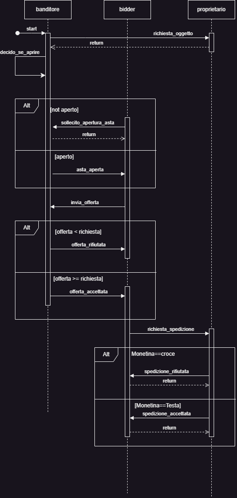

# Asta
> DALI Multi Agent Systems Framework

Questo sistema multi agente propone di simulare un'asta in cui il banditore risulta essere l'agente centrale che si occupa di gestire l'asta, prendendo in carico l'oggetto di un agente chiamato "proprietario" e di prendere in carico le offerte dei compratori (bidders).
Il proprietario mette a disposizione al banditore un numero illimitato dello stesso oggetto e sancisce un prezzo di vendita: chiunque offra un prezzo superiore o uguale a quello concordato dal proprietario, si aggiudicherà l'oggetto.
Il banditore, per decidere di aprire l'asta, lancia un dado composto da numeri che vanno da 1 a 3. Se il dado restituisce 1, allora fa partire l'asta.
Se dopo un tot di tempo il banditore ancora non apre l'asta, i bidders invieranno un sollecito al banditore, quindi quest'ultimo si troverà forzato ad aprirla.
Il sistema sarà sviluppato su windows.

## Agenti

* Banditore:
  - E' l'agente centrale del programma.
  - Gestisce le offerte ricevute dai compratori.
  - Mette in vendita l'oggetto. 

* Proprietario:
  - E' il proprietario dell'oggetto che vuole vendere;
  - Ha a disposizione risorse risorse illimitate di quell'oggetto;
  - E' colui che rende disponibile la vendita dell'oggetto;
  

* Bidders:
  - Sono coloro che fanno delle offerte al banditore;
  - Se il bidder ha acquistato un oggetto, non può più fare delle offerte.

## Sequence Diagram

## Tabella Event/Action - banditore

| Evento/Azione       | Descrizione                                                                                                                                                                                               |
|---------------------|-----------------------------------------------------------------------------------------------------------------------------------------------------------------------------------------------------------|
| prontoI             | Il banditore saluta tutti e dichiara di essere pronto, se non lo ha già fatto                                                                                                                             |
| richiesta_oggettoI  | Se il banditore non ha l'oggetto da bandire all'asta, lo richiede al proprietario                                                                                                                         |
| oggettoE            | Riceve dal proprietario l'oggetto da bandire all'asta.                                                                                                                                                    |
| decido_se_aprireI   | il proprietario lancia un dado che nelle facciate ha dei numeri che vanno da 1 a 3, se esce 1 allora apre le offerte.                                                                                     |
| sollecitoE          | Se il banditore ancora apre l'asta, i bidder gli inviano un sollecito per aprirla.                                                                                                                        |
| apro_offerteI       | Il banditore fa partire l'asta.                                                                                                                                                                           |
| invia_messaggioA    | Il banditore informa i bidders che l'asta è aperta.                                                                                                                                                       |
| propostaE           | Il banditore riceve dal bidder una proposta di offerta per quell'oggetto e la immagazzina in una lista.                                                                                                   |
| monitoro_offerteI   | Il banditore controlla che tutti abbiano inviato l'offerta.                                                                                                                                               |
| considero_offerteA  | Il banditore dichiara l'asta conclusa e comincia a verificare le offerte.                                                                                                                                 |
| verifica_offerte(L) | Il banditore controlla, uno alla volta, se l'offerta proposta dal bidder superi o eguagli la richiesta del proprietario: in caso di risposta affermativa accetta l'offerta, in caso contrario la rifiuta. |

## Tabella Event/Action - proprietario

| Evento/Azione       | Descrizione                                                                                                                                                                                               |
|---------------------|-----------------------------------------------------------------------------------------------------------------------------------------------------------------------------------------------------------|
| prontoI             | Il proprietario saluta tutti e dichiara di essere pronto, se non lo ha già fatto                                                                                                                          |
| richiestaE          | Il proprietario riceve la richiesta da parte del banditore di dichiarare l'oggetto da mettere all'asta.                                                                                                   |
| richiesta_invioE    | Il proprietario riceve una richiesta dal bidder di spedire l'oggetto che ha vinto. Il proprietario lancia una moneta: se esce testa, allora spedisce l'oggetto, altrimenti non lo spedisce.               |

## Tabella Event/Action - bidder

| Evento/Azione       | Descrizione                                                                                             |
|---------------------|---------------------------------------------------------------------------------------------------------|
| prontoI             | Il bidder saluta tutti e dichiara di essere pronto, se non lo ha già fatto                              |
| attendo_banditoreI  | Il bidder attend che il banditore apri l'asta.                                                          |
| no_aperturaI        | Il bidder, dopo un periodo di tempo, decide di inviare un sollecito al banditore per far aprire l'asta. |
| aperturaE           | Il bidder riceve dal banditore un messaggio in cui si comunica che l'asta è aperta.                     |
| faccio_offertaI     | Il bidder effettua una offerta all'oggetto.                                                             |
| contatto_banditoreI | Il bidder invia la proposta di offerta al banditore.                                                    |
| accettataE          | Il bidder si vede accettare l'offerta e invia una richiesta di spedizione al proprietario.              |

